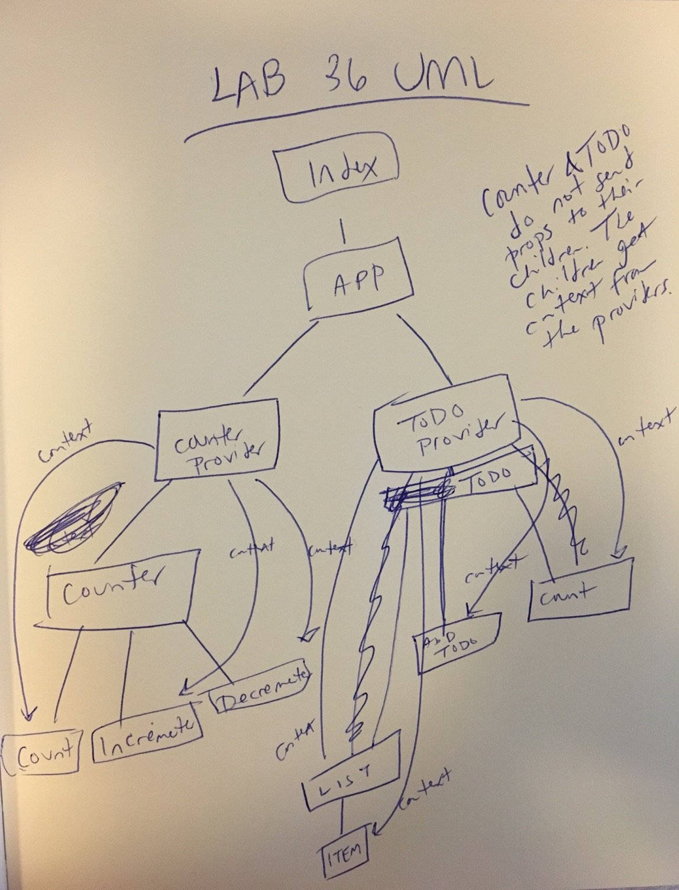

 LAB
============================================================================    

## Lab 36: Context API

### Author: Joseph Wolfe

### Links and Resources
* [PR](https://github.com/charmedsatyr-401-advanced-javascript/lab-36/pull/1)
* [](https://travis-ci.com/charmedsatyr-401-advanced-javascript/lab-36)
* [Netlify](https://youthful-rosalind-0dd0f6.netlify.com/)

### Modules
```
.
├── package.json
├── public
│   ├── favicon.ico
│   ├── index.html
│   └── manifest.json
├── README.md
├── src
│   ├── app.js
│   ├── app.test.js
│   ├── components
│   │   ├── counter
│   │   │   ├── counter-provider.js
│   │   │   └── index.js
│   │   ├── if
│   │   │   └── index.js
│   │   └── todo
│   │       ├── add-todo.js
│   │       ├── count.js
│   │       ├── form.js
│   │       ├── index.js
│   │       ├── item.js
│   │       ├── list.js
│   │       ├── todo-provider.js
│   │       └── todo.scss
│   └── index.js
└── yarn.lock

6 directories, 20 files

```
### Summary
The application has been refactored to be fully modular and use the React Context API for functionality. Context wrappers only provide the appropriate context to their children; I intentionally avoided providing global context.

`index.js` renders `<App/>`.
`<App/>` renders components `<Counter/>` and `<ToDo/>`.

Both `<Counter/>` and `<ToDo/>` components are function components that receive context from class component context providers, `<CounterProvider/>` and `<ToDoProvider/>`, respectively.

`./src/components/counter/` contains all files related to `<Counter/>`. Its `index.js` contains and renders the `<Count/>`, `<Decrementer/>`, `<Incrementer/>`, and `<Counter/>` components.

`./src/components/todo/` contains all files related to `<Todo/>`. Its `index.js` renders `<Count/>` (for the To Do List), `<AddToDo/>`, and `<List/>`. The `<ToDo/>` component uses `<If/>` from `./src/components/if/index.js` for some conditional logic.

#### Tests
* What assertions were made?
  * A placeholder test is in place.

* What assertions need to be / should be made?
  * Snapshot and functional tests could be made for each component.
  * Tests could ensure each component properly receives and handles its context.

#### UML
  
